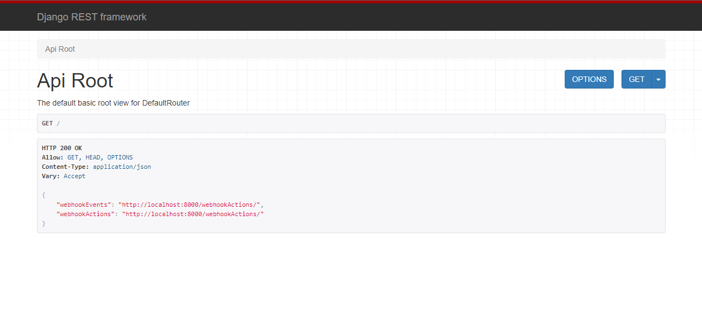

### DataDev Day November 2023
# Tableau Webhooks + AWS Lambda
##### Kyle Massey | *Twitter/X*: @UpInYourVizness | *github*: @kjmassey
---

# Event Logger Backend
- Django + djangorestframework
- MySQL via AWS RDS
- tableauserverclient (TSC)
- [Click here](https://github.com/kjmassey/vue-tableau-webhooks-ui) for frontend source

### Installation
##### NOTE: Exact cli/terminal syntax may vary by OS
1. Clone this repo
2. Create Python virtual environment:
   - *python -m venv name_of_env*
   - *name_of_env* = your virtual environment name
   - 'venv' is just fine :)
3. In a Terminal, run:
   - *pip install -r requirements.txt*
   - *django-admin --version*
   - If your terminal returns a version number, you're good to go!
4. Activate your virtualenv
   - e.g. *source venv/Scripts/activate* (bash)

### Constants Configuration
1. Open **constants.py**
2. Add your values for the following:
   ```
   # Database config
   DB_USER = "YOUR_DB_USER"
   DB_PASSWORD = "YOUR_DB_PASSWORD"
   DB_HOST = "YOUR_DB_HOST"
   DB_PORT = "YOUR_DB_PORT"
   DB_SCHEMA = "YOUR_DB_SCHEMA"

   # Tableau Personal Access Token
   PAT_NAME = "YOUR_PAT_NAME"
   PAT_SECRET = "YOUR_PAT_SECRET"

   # Tableau Server Config
   TSC_SERVER_URL = "YOUR_TABLEAU_SERVER_URL"
   TSC_SITE_NAME = "YOUR_SITE_NAME"
   ```

### Database Configuration
##### NOTE: This can be done with any database that django/drf supports! AWS MySQL is used here.

###### If using MySQL, these settings do not need to be changed
1. If changes are needed, open **config > settings.py**
2. Make updates starting on line 86:
   ```
   DATABASES = {
      "default": {
         "ENGINE": "django.db.backends.mysql",
         "NAME": f"{DB_SCHEMA}",
         "USER": f"{DB_USER}",
         "PASSWORD": f"{DB_PASSWORD}",
         "HOST": f"{DB_HOST}",
         "PORT": f"{DB_PORT}",
      }
   }
    ```

### Starting the API
1. Run: *python manage.py runserver 0.0.0.0:8000*
2. Visit [http://localhost:8000](http://localhost:8000)
3. If you see the page below, everything went swimmingly!
   